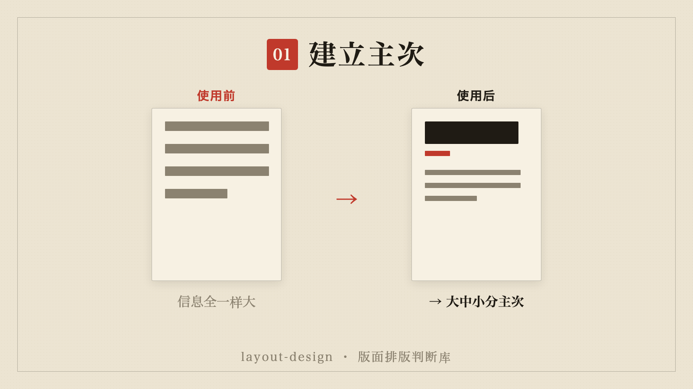
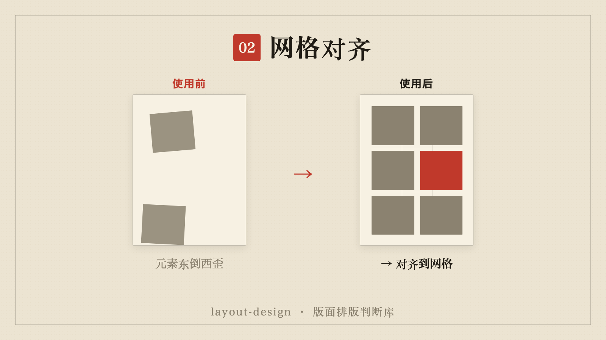
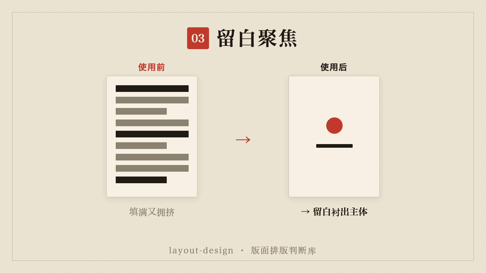
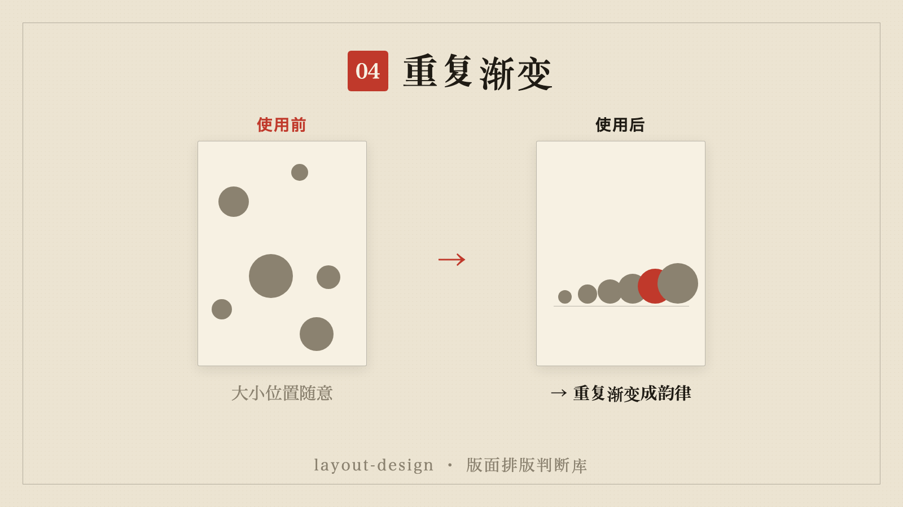
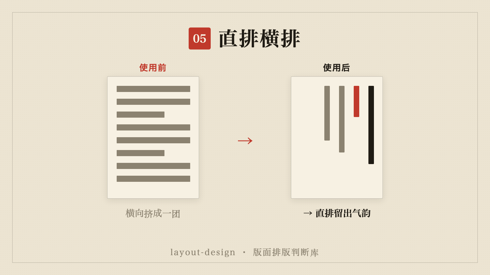
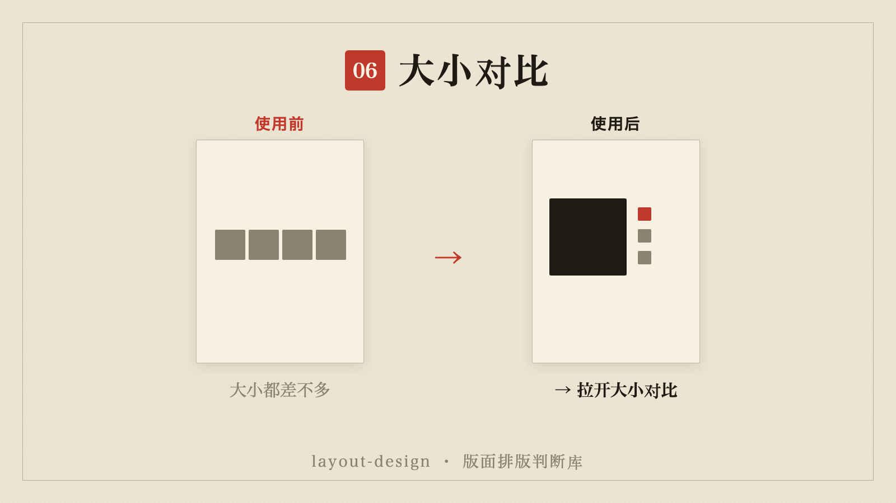
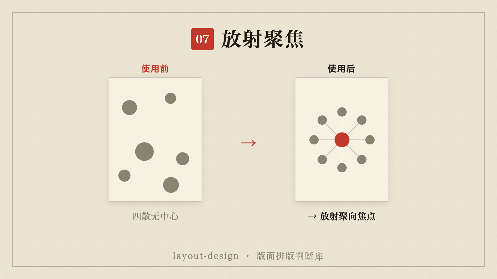
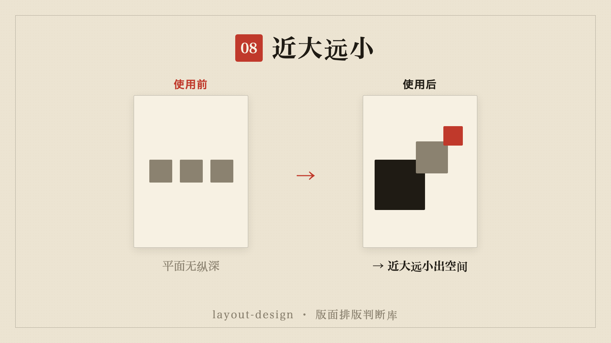
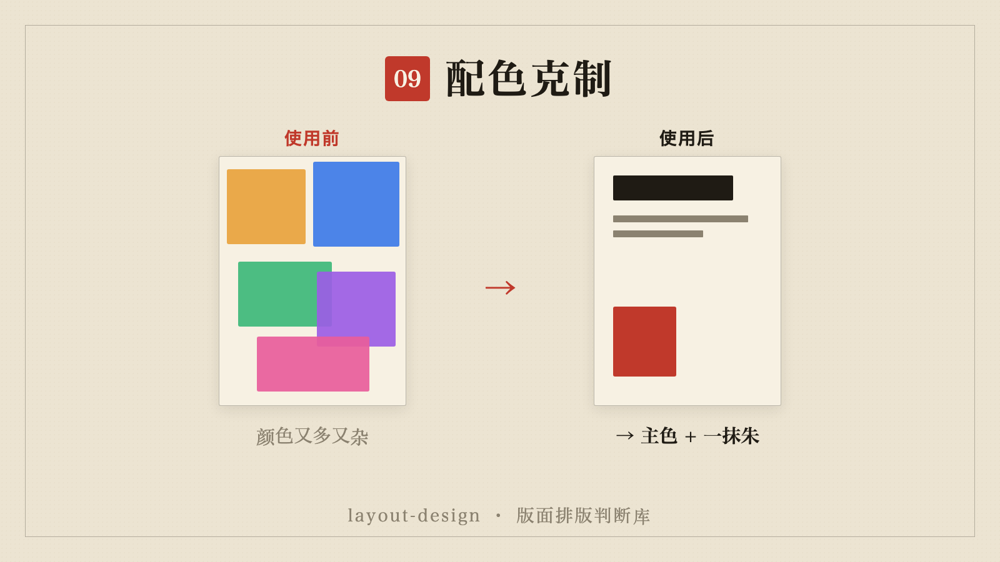
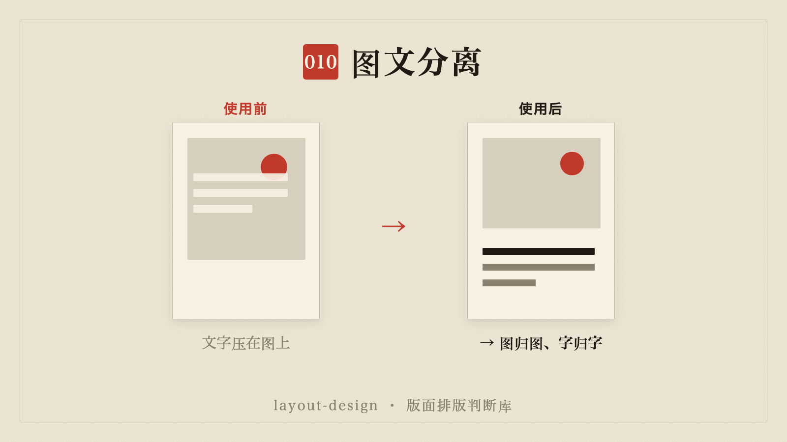

# layout-design · 版面排版判断库

> 一个给 **视频剪辑 / 花字 / 字幕 / 封面 / 图形** 用的 Claude 技能（skill）：把日本平面设计的版面法则，翻译成"这版排版好不好、该怎么改"的可执行判断 + 质检清单。
> 来源：《日本版面的法則：版型·字體·色彩·留白·配圖》(gaatii 光體)，110 个日本设计案例。
> 配套 [shot-language](https://github.com/Penny777btc/shot-language)：那个管镜头里的**画面构图**，这个管屏幕上的**版面排版**。

---

## 这是什么

剪视频做图时你大概率遇到过：**"这个花字 / 封面看着乱、不高级，但说不上来哪里不对。"**
这个 skill 把"说不上来的感觉"，变成**一条条能复述、能检查的版面规则**。

核心一句话：

> **"高级感"不是加装饰，而是 —— 定一个视觉核心 → 用字级/位置/留白分主次 → 网格对齐 → 配色克制。高级来自"减"，不是"加"。**

---

## 它在视频里帮你做什么

| 场景 | 这个 skill 给你的判断 |
|---|---|
| **花字 / 字幕** | 大中小字级分主次、一眼看到最重要那句、标题字呼应主题、别挡主体 |
| **封面 / 缩略图** | 一个视觉核心 + 留白；主色 + 一抹强调色；标题字呼应内容 |
| **Remotion 图形 / 动效卡片** | 网格对齐、重复/渐变/对比、配色克制、系列版式统一 |
| **海报 / 宣传图** | 五大模块全套 |
| **图形质检** | 跑"七条版面体检"，把"看着乱"定位成可改的项 |

---

## 怎么用

### 作为 Claude Code 技能

```bash
# 项目级
git clone https://github.com/Penny777btc/layout-design .claude/skills/layout-design
# 或全局级
git clone https://github.com/Penny777btc/layout-design ~/.claude/skills/layout-design
```

之后 Claude 在你做花字/字幕/封面/图形/质检时会自动参考它；也可直接说：

> "用 layout-design 看看这个封面排版有什么问题"

- `SKILL.md`：操作层（何时用、怎么判断、七条质检清单）。
- `reference.md`：原理层（五大模块深读，每条都带"在视频图形里怎么落地"）。

### 当成一份"版面设计清单"来读

不用 AI 也行。下面 10 个法则的 before/after，本身就是 10 张速查卡。

---

## 十个法则 · 每个都是一组 before / after

这些对比图本身就用了书里的版面法则来做（和纸底、细罫版框、明朝体、朱印、大留白、单一朱红）——**用版面讲版面**。

### 01 · 建立主次

信息全一样大 → 大中小字级拉开层级，一眼看到最重要那句。
**视频里**：花字/字幕的黄金律——最重要的一句最大，次要的缩小退后。

### 02 · 网格对齐

元素东倒西歪 → 对齐到网格，"整洁感"就来了。
**视频里**：Remotion 图形、信息卡片先铺一层网格再放元素。

### 03 · 留白聚焦

填满整屏又挤又乱 → 大面积留白把主体衬出来（源自水墨、侘寂、間）。
**视频里**：封面/缩略图给主标题足够留白，别塞满；想要"高级/安静"就加留白。

### 04 · 重复渐变

大小位置随意 → 重复 + 大小渐变，排成韵律（日本设计最常用的手法）。
**视频里**：一组同类元素靠重复+大小变化立刻产生主次和节奏。

### 05 · 直排横排

横向挤成一团 → 直排（縦書き）留出气韵，是日式版面的标志。
**视频里**：竖屏花字、标题可试直排；直/横混排增层次（需有理由）。

### 06 · 大小对比

大小都差不多、平淡 → 拉开大小对比（大面积 vs 一点＝最高级的数量对比）。
**视频里**：主标题敢做大，次要信息敢做小，对比一拉画面就有张力。

### 07 · 放射聚焦

元素四散、无中心 → 放射构图聚向焦点，强动感、强聚焦。
**视频里**：封面/图形想要冲击力时，让元素聚向一个中心点。

### 08 · 近大远小

平面、没纵深 → 近大远小制造空间感与层次。
**视频里**：图形/插画用近大远小，画面立刻有纵深，不再贴在一个平面上。

### 09 · 配色克制

颜色又多又杂、画面脏 → 一个主色 + 一抹朱（强调色）。
**视频里**：配色超过"主色 + 2"就开始脏；重点用一点信号色顶出来。

### 10 · 图文分离

文字直接压在图上、互相打架 → 图归图、字归字，文字让位或绕图。
**视频里**：花字别压住画面主体；先定视觉核心（图/录屏画面）再排字。

---

## 它不做什么（边界）

- **不替代具体执行**：怎么用 Remotion/PS 实现归工具。它只管"该不该、怎么排、为什么"。
- **不是硬规则**：版面服务于内容与调性（教程要克制可信，封面可适度花哨博点击）。
- 偏"静态版面"判断；动效编排另说。

---

## 文件结构

```
layout-design/
├── README.md          你正在看的说明
├── SKILL.md           技能本体（操作层 + 七条质检清单）
├── reference.md       原理层（五大模块深读 + 落地映射）
└── images/            10 个法则的 before / after 配图
```

---

*把方法变成能力。配套 [shot-language](https://github.com/Penny777btc/shot-language)：一套镜头，一套版面。*
